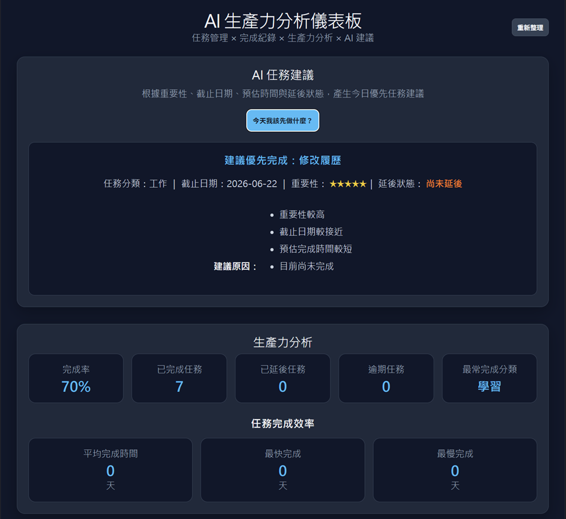
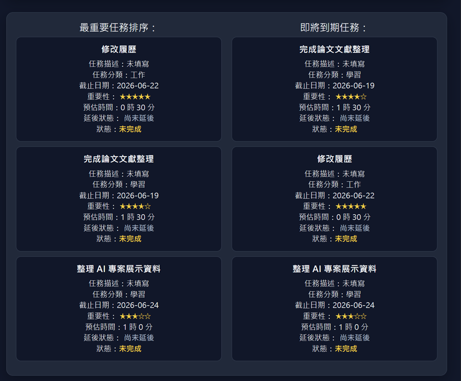
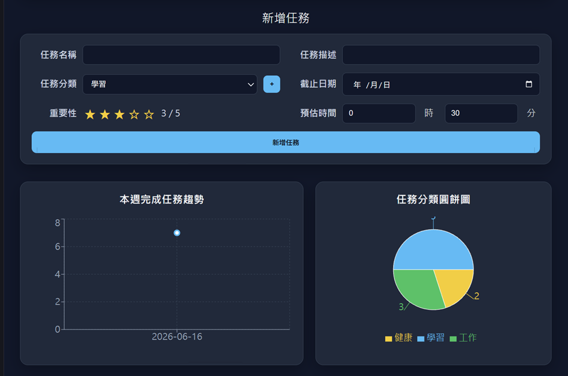
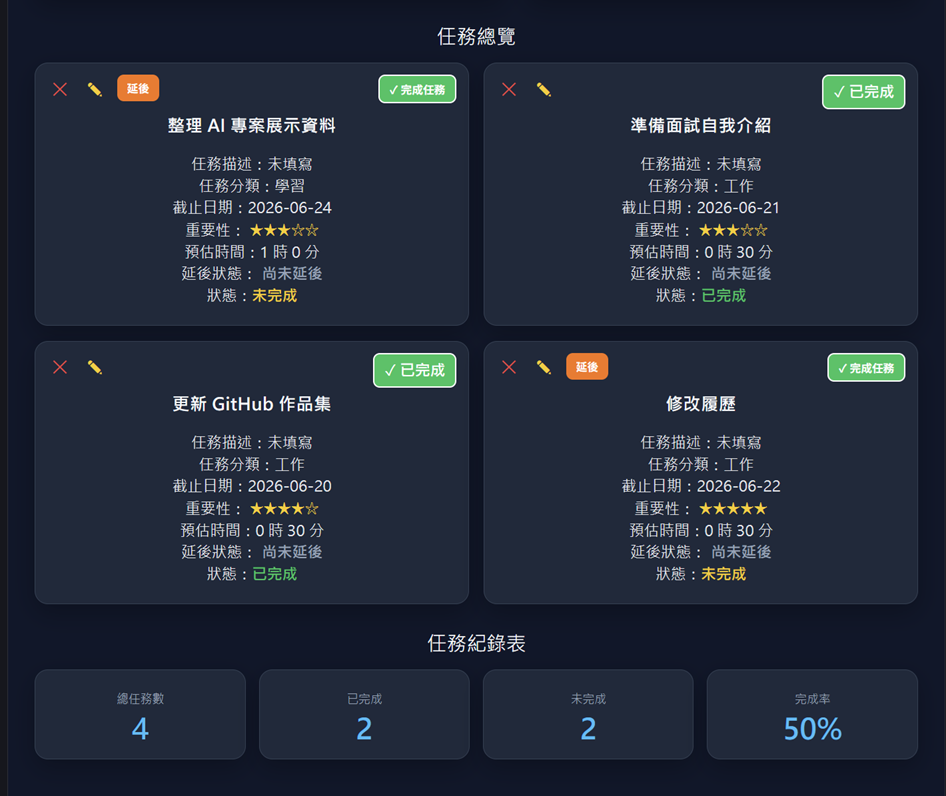

# AI 任務管理與生產力分析平台

## 專案簡介

AI 任務管理與生產力分析平台（AI Task Productivity Dashboard）是一套結合任務管理、生產力分析、行為追蹤與 AI 任務建議的 Web 應用系統。

本專案不只是傳統 Todo App，而是透過使用者的任務資料進行分析，協助使用者了解自己的工作習慣與任務執行情況。

核心流程：

任務管理 → 完成紀錄 → 行為分析 → Dashboard 視覺化 → AI 任務建議

---

## 專案目標

建立一套能夠：

* 管理日常任務
* 記錄任務完成情況
* 分析個人生產力
* 提供任務優先順序建議
* 透過 Dashboard 呈現分析結果

的 AI 生產力分析平台。

---

## 系統功能

### 任務管理

* 新增任務
* 編輯任務
* 刪除任務
* 完成任務
* 任務分類管理
* 截止日期管理
* 重要性設定（1~5 星）
* 預估完成時間

---

### 任務延後機制

支援延後任務功能：

* 每個任務僅能延後一次
* 延後後自動增加 1 天截止日期
* 系統記錄延後狀態

---

### AI 任務建議

系統根據：

* 任務重要性
* 截止日期
* 預估完成時間
* 延後狀態

自動推薦目前最應優先完成的任務。

範例：

建議優先完成：履歷修改

原因：

1. 重要性較高
2. 截止日期較接近
3. 預估完成時間較短
4. 目前尚未完成

---

## 生產力分析功能

### 生產力指標

顯示：

* 任務完成率
* 已完成任務數
* 已延後任務數
* 逾期任務數
* 最常完成分類

---

### 任務完成效率分析

分析使用者完成任務所需時間：

* 平均完成時間
* 最快完成時間
* 最慢完成時間

---

### 重點任務分析

顯示：

* 最重要任務排序
* 即將到期任務

協助使用者掌握目前最需要處理的工作。

---

## Dashboard 視覺化

### 本週完成任務趨勢圖

使用 Recharts 建立折線圖。

功能：

* 顯示每日完成任務數
* 觀察近期生產力變化

---

### 任務分類圓餅圖

顯示各類型任務分布情況：

* 學習
* 工作
* 健康
* 生活
* 其他分類

---

## 技術架構

### Frontend

* React
* Vite
* Recharts

### Backend

* Flask
* RESTful API

### Database

* SQLite

---

## 資料表設計

### Tasks

| 欄位名稱              | 型態      |
| ----------------- | ------- |
| id                | INTEGER |
| title             | TEXT    |
| description       | TEXT    |
| category          | TEXT    |
| deadline          | TEXT    |
| importance        | INTEGER |
| estimated_minutes | INTEGER |
| postpone_count    | INTEGER |
| status            | TEXT    |
| created_at        | TEXT    |
| completed_at      | TEXT    |

---

## API 設計

### 任務管理

GET /api/tasks

POST /api/tasks

PUT /api/tasks/<id>

DELETE /api/tasks/<id>

PUT /api/tasks/<id>/postpone

---

### 分析 API

GET /api/analytics/summary

GET /api/analytics/weekly

GET /api/analytics/task-types

GET /api/analytics/productivity

GET /api/analytics/completion-time

---

### AI API

POST /api/ai/suggest

---

## Demo 展示流程

1. 新增任務
2. 建立任務分類
3. 編輯任務
4. 完成任務
5. 延後任務
6. 取得 AI 任務建議
7. 查看生產力分析
8. 查看折線圖與圓餅圖
9. 查看任務完成效率分析

---

## 專案亮點

### 1. 不只是 Todo App

除了任務管理之外，加入：

* 生產力分析
* 行為追蹤
* AI 建議系統

提升專案完整度。

### 2. 資料驅動分析

透過任務紀錄分析：

* 完成率
* 拖延狀況
* 完成效率

協助使用者了解自身工作習慣。

### 3. Dashboard 化呈現

透過圖表與統計卡片呈現分析結果，提高使用體驗與資料可視化效果。

---

## 未來優化方向

### Phase 2

* 使用者登入系統
* PostgreSQL
* 多使用者支援

### Phase 3

* OpenAI API 整合
* LLM 任務建議
* 個人化生產力分析

### Phase 4

* Google Calendar 整合
* 行事曆同步
* 行動裝置版本

---

## 履歷專案描述

AI Task Productivity Dashboard

使用 React、Flask 與 SQLite 開發之全端生產力分析平台。

系統整合任務管理、生產力分析、資料視覺化 Dashboard 與 AI 任務建議功能，透過完成率分析、任務效率分析與任務優先排序機制，協助使用者提升工作效率與任務管理能力。

# 系統畫面展示

## AI 任務建議與生產力分析

---

## 重點任務分析

---

## 生產力圖表

---

## 任務管理總覽

